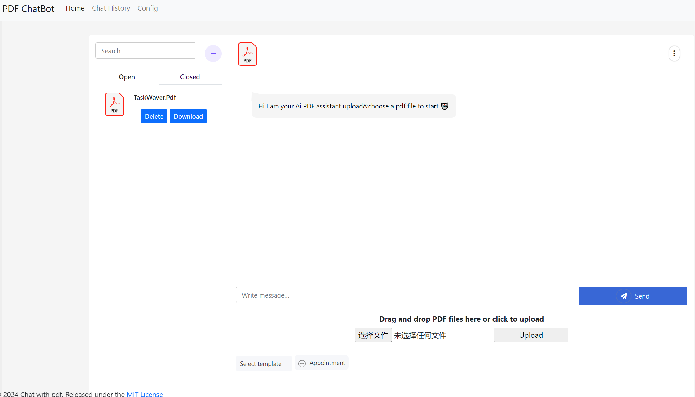

## Quick Start
To set up your environment, you will need to generate a .env file that contains your OpenAI API key and download the necessary packages.

### Install requirements.txt
Install everything listed in the `requirements.txt` file

```bash
flask run
```
The program should start at local 5000
```
* Debug mode: off
WARNING: This is a development server. Do not use it in a production deployment. Use a production WSGI server instead.
 * Running on http://127.0.0.1:5000
```
